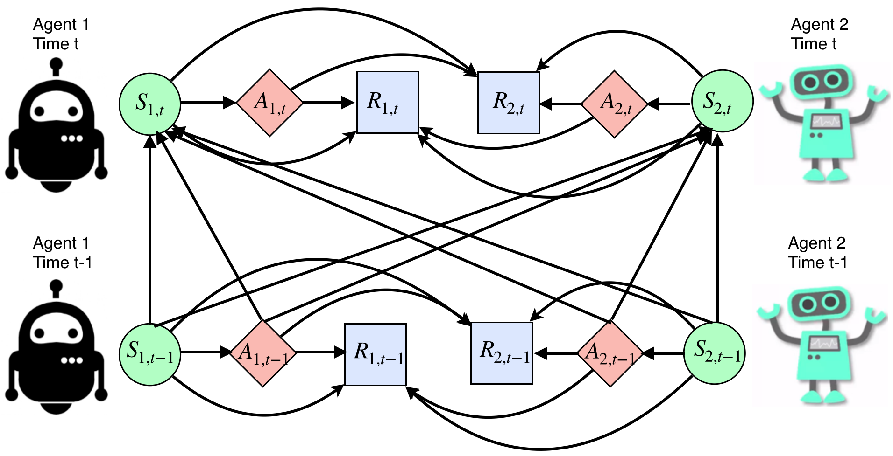

# A MULTI-AGENT REINFORCEMENT LEARNING FRAMEWORK FOR OFF-POLICY EVALUATION IN TWO-SIDED MARKETS

This repository contains the implementation for the paper "A MULTI-AGENT REINFORCEMENT LEARNING FRAMEWORK FOR OFF-POLICY EVALUATION IN TWO-SIDED MARKETS" (AOAS, 2022+) in Python.

## Summary of the paper

The two-sided markets such as ride-sharing companies often involve a group of subjects who are making sequential decisions across time and/or location. With the rapid development of smart phones and internet of things, they have substantially transformed the transportation landscape of human
beings. In this paper we consider large-scale fleet management in ride-sharing companies that involve multiple units in different areas receiving sequences
of products (or treatments) over time. Major technical challenges, such as policy evaluation, arise in those studies because (i) spatial and temporal proximities induce interference between locations and times; and (ii) the large number of locations results in the curse of dimensionality. To address both
challenges simultaneously, we introduce a multi-agent reinforcement learning (MARL) framework for carrying policy evaluation in these studies. We
propose novel estimators for mean outcomes under different products that are consistent despite the high-dimensionality of state-action space. The proposed estimator works favorably in simulation experiments. We further illustrate our method using a real dataset obtained from a two-sided marketplace company to evaluate the effects of applying different subsidizing policies.

**Figure**: Causal diagram for a multi-agent system with two agents. $(S_{j,t}, A_{j,t}, R_{j,t})$ represents the statetreatment-outcome triplet of the $j$th agent at time $t$.

## Requirements
* Python version: Python 3.6.8 :: Anaconda custom (64-bit)
* Main packages for the proposed estimator
    - numpy
    - scipy
    - sklearn
    - tensorflow == 1.13.2
    - itertools
* Additional packages for experiments
    - pickle
    - multiprocessing
    - os
    - time
    - sys
    - logging
    - warnings

## File Overview
### Our estimator
* `main.py`: main function for the proposed estimator and its components
* `weight.py`: neural network for the weight estimation part
* `utils.py`: helper functions for `main.py` and simulation parts

### Synthetic data
* `simu.py`: experiment script for reproducing the results in the paper
* `simu_funs.py`: main functions for the simulation experiment
* `simu_DGP.py`: data generating functions for the simulation experiment

### Real data-based simulation
* `Real_Simu/policy_defination.py`: definitions of target policies 
* `Real_Simu/est_with_pseudo_data.ipynb`: notebook to obtain estimated policy value with the pseudo-dataset. 
* `Real_Simu/real_data_input.py`: functions for preparing input data
* `Real_Simu/pseudo_data`: a pickle file. One simulated dataset. 

### Testing the Markov property
Files `_core_test_fun.py`, `_QRF.py`, and `_uti_basic.py` are all from the package [TestMDP](https://github.com/RunzheStat/TestMDP). 

## How to reproduce simulation results
To reproduce the results presented in the Simulaiton section:

1. Change the working directory to the main folder 
2. Run `python simu.py` , which generates two files `final_sd.txt` and `final_T.txt`
3. Load them with `pickle.load` and then we can get the results that Figure 4 is based on.

## How to test the Markov property
We use the testing procedure developed in the package [TestMDP](https://github.com/RunzheStat/TestMDP). 
Essentially, we collect the simulated trajectories, organize them into the expected input formats, and call the test function. 
See `test.ipynb` for details. 

## How to reproduce the real data-based simulation
The real data used in the paper is from a ride-sharing company. 
Due to data confidentiality, we are not allowed to release some sensitive data such as the Gross Merchandise Volume and the implemented subsidizing policies. 
Therefore, results can not be exactly reproduced. 

That said, we try our best to provide a similar simulation environment. 
Specifically, a dataset generated by the simulator is provided and can be used with the estimators. True policy values are also provided. This dataset corresponds to the passenger-side subsidizing policies. 

To reproduce the estimation results corresponding to the generated pseudo dataset, run `Real_based_Simulation/est_with_pseudo_data.ipynb`. 
